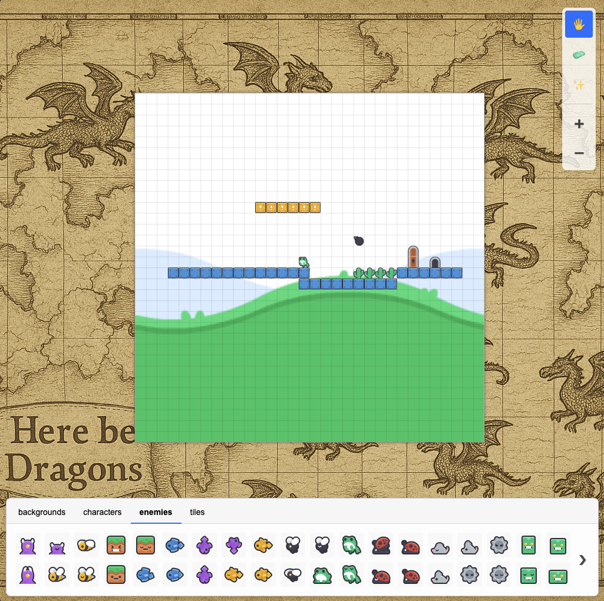

# Devvit Tilemap Editor [[live demo](https://pages.github.snooguts.net/kyle-maxwell/tilarium/)]

Let's make a web-based 2D tilemap editor that runs inside Devvit. Think: Super Mario Maker vibes, but for Reddit. This is an MVP and shipped as an npm library that doesn't need server components.

## Features

- Touch-Friendly: The editor is optimized for tap, drag, and pinch interactions, making it seamless to use on phones and tablets.
- Lightweight: It loads instantly, runs entirely in-browser, and keeps performance smooth even on low-end devices.
- Embeddable: The editor is self-contained and easily pluggable into any Devvit app or webview with no backend or build tools required
- Uses open asset packs, e.g: https://kenney.nl/assets/new-platformer-pack

## Editor

- Grid-based: all tiles are the same size and shape for simplicity.
- Simple toolset: place tile, scroll, eraser
- Multiple layers: each tile has an inherent zIndex (e.g. ocean-tile: 0, shark: 1). Conflicting tiles can't be placed at the same layer and position. Eraser targets the top tile at that location. No pick-a-layer affordances for simplicity.

## Developers

- Configurable: map size, tile size, asset pack, and layer groupingss.
- Exportable: simple json format for use the play mode of your game

## CI/CD

This project uses Drone CI to automatically deploy the example application to GitHub Pages.

To enable this, you will need to create a secret in your Drone repository settings named `github_token`. This secret should contain a GitHub Personal Access Token with the `repo` scope. This token is used to push the build output to the `gh-pages` branch.
